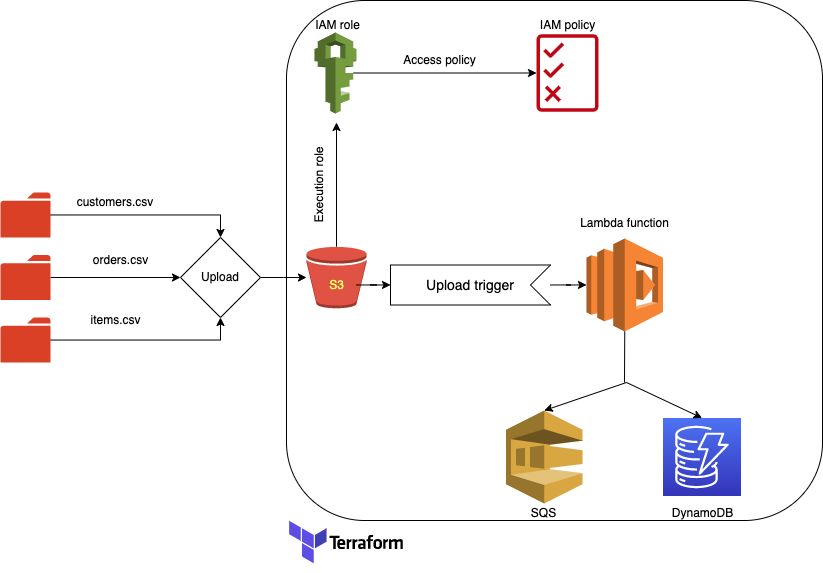

# awslambdaprocessor
Terraform code for processing files uploaded to S3 using Lambda and persist them in DynamoDB

# problem 
The idea is to set up a data procesing workflow which gets triggered based on a specific file uploads to a S3 bucket and use load and transform operations respectively to produce data in necessary formats for further processing

# solution
Process the upload event on the target s3 bucket and invoke a lambda function that will load the csv files into a panda datframe and later perfomr join operations on them to finally produce a dataframe that has the data in the required format. The sample data is available in the data directory. After the Dataframe is ready, convert that into a JSON format and publish it to the SQS queue for consumption and persist the json in the key value data store DynamoDB

# scale

The current solution is not scalable, mainly because this was done with a very low scale in mind. In order to make this more scalable, there are certain things that I would start off with.

1. Do not process the files using a data frame, because as the number of records in the file increases, it is not a scalable approach instead load the data incrementally into a date partioned datastore with a Master/Slave architecture using a Lambda function and make sure that the csv files are direcly loaded into a SQL like data store for further processing.

2. Parallize the data loading and split the files into independent chunks for effective multiprocessing and faster data load

3. After loading the files into tables run a join query to generate the necessary data and later store the json data into mongoDB/DynamoDB

4. Improve the CI/CD since there could be multiple deployments to the pipeline

5. Use dead letter queues to make sure no messages are lost in transition